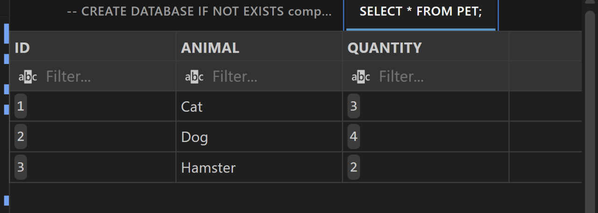
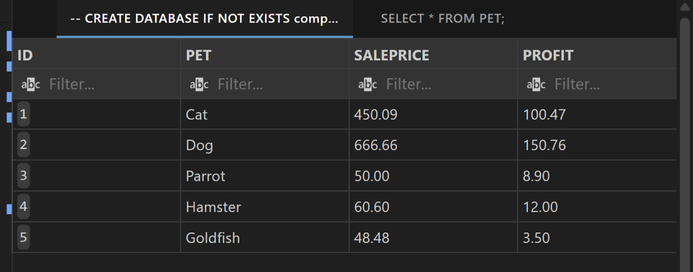

# SQL Lab — CREATE, ALTER, TRUNCATE, DROP (MySQL + VS Code)

This repository demonstrates basic SQL Data Definition Language (DDL) operations using **MySQL** and **Visual Studio Code**.

The goal of the lab is to practice common database operations such as:

- Creating databases
- Creating tables
- Inserting records
- Altering table structure
- Updating records
- Truncating tables
- Dropping tables

All operations are implemented in a single SQL script:

```

create_alter_truncate_drop.sql

```

The script executes a full workflow starting from database creation and ending with table deletion.

---

# Initial Tables

After the database and tables are created and populated with initial data, the tables look like the following.

## PET Table



## PETSALE Table



These figures represent the initial state of the data before schema modifications are applied.

---

# Environment Setup

Follow these steps to reproduce the project locally.

---

# 1. Install MySQL

Download MySQL Community Server:

https://dev.mysql.com/downloads/mysql/

During installation:

- Select **MySQL Server**
- Set a **root password**
- Keep the default port:

```

3306

```

After installation verify MySQL is available by running:

```

mysql --version

```

---

# 2. Install Visual Studio Code

Download VS Code:

https://code.visualstudio.com/

Install it normally for your operating system.

---

# 3. Install Required VS Code Extensions

Open Extensions in VS Code:

```

Ctrl + Shift + X

```

Install the following extensions.

### SQLTools

Extension ID:

```

mtxr.sqltools

```

### SQLTools MySQL Driver

Extension ID:

```

mtxr.sqltools-driver-mysql

```

These extensions allow VS Code to connect directly to a MySQL server and run SQL queries.

---

# 4. Create a MySQL Connection in VS Code

Open the command palette:

```

Ctrl + Shift + P

```

Run:

```

SQLTools: Add New Connection

```

Choose:

```

MySQL

```

Fill the connection fields:

```

Server Address: localhost
Port: 3306
Username: root
Password: <your mysql password>
Database: mysql

```

Save the connection.

You should now see a connection such as:

```

mysql-local

```

---

# Running the Lab Script

Open the SQL file:

```

create_alter_truncate_drop.sql

```

Attach the file to the MySQL connection using SQLTools.

The script contains **multiple logical blocks** separated by comment lines such as:

```

---

```

Each block represents a specific stage of the lab.

Examples of blocks in the workflow include:

- database creation
- table creation
- inserting records
- querying tables
- altering table structure
- updating values
- truncating tables
- dropping tables

---

# Important Execution Note

When running the script inside VS Code:

**Only one block should be executed at a time.**

To do this safely:

1. Comment out all other blocks
2. Leave only the current block active
3. Run the query

Blocks can be commented using:

```

-- comment

```

or by selecting lines and pressing:

```

Ctrl + /

```

This prevents errors such as:

- table already exists
- duplicate column
- repeated inserts

---

# Workflow Summary

The lab follows the typical lifecycle of a relational table:

1. Create database
2. Create tables
3. Insert sample data
4. Query tables to verify data
5. Modify table structure using ALTER
6. Update values using data from another table
7. Remove columns
8. Rename columns
9. Truncate table data
10. Drop table entirely

This sequence demonstrates how SQL schema and data evolve during real database operations.

---

# Repository Structure

```

create_alter_truncate_drop.sql
README.md
table0.jpg
table1.jpg

```

---

# Notes

- The SQL script is organized in sequential execution blocks.
- When executing inside VS Code, blocks should be run individually.
- The images included in this repository show the initial state of the tables used in the lab.

---


SQL lab implementation using MySQL and Visual Studio Code.
```
